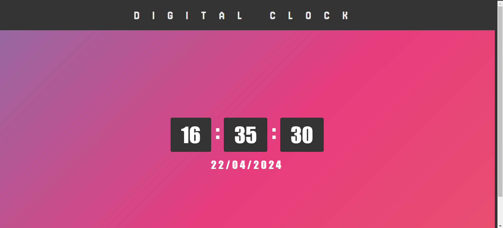

# Task 2- Digital Clock

This project is a simple digital clock developed using HTML, CSS, and JavaScript. It displays the current time in real-time, updating every second.

# Features
Displays hours, minutes, and seconds.
Updates in real-time.

# Getting Started
To get a local copy up and running follow these simple steps:

Clone the repository
sh
Copy code
git clone https://github.com/your-username/digital-clock.git
Open the index.html file in your browser.

# Usage
Simply open the index.html file in your web browser to view the digital clock.

# Contributing
Contributions are what make the open-source community such an amazing place to learn, inspire, and create. Any contributions you make are greatly appreciated
